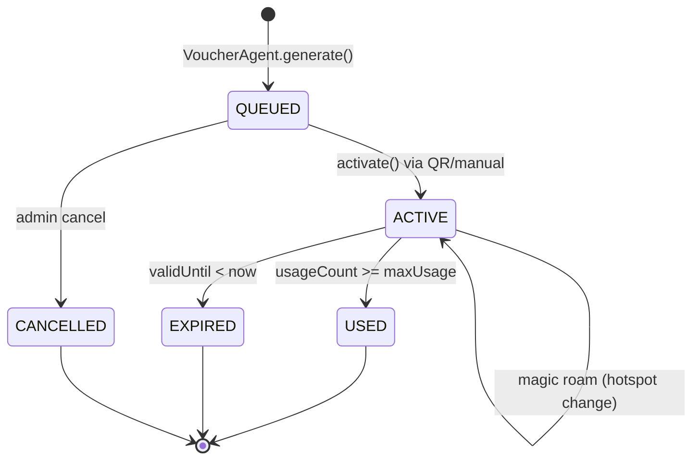
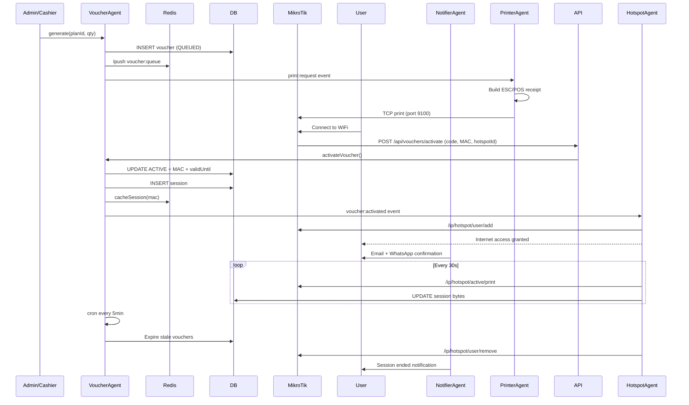
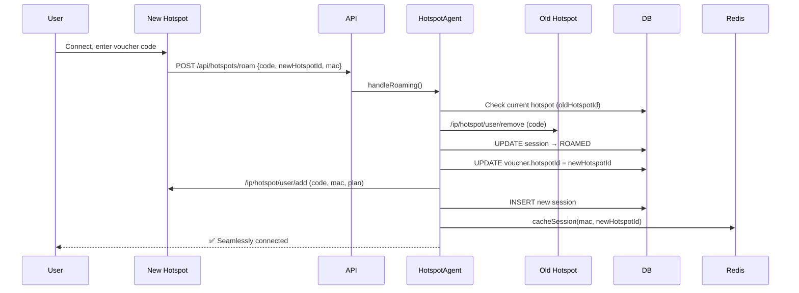

# AgentClaw — Voucher Lifecycle

## States

```
QUEUED → ACTIVE → USED
                ↘
                EXPIRED
QUEUED → CANCELLED
```

## State Machine Diagram



## End-to-End Voucher Flow



## Magic Roaming Flow



## POS vs Online Sale — Transaction Path

```mermaid
flowchart TD
    subgraph POS["POS Sale (Physical)"]
        C[Cashier selects plan + qty] --> P[POST /api/pos/checkout]
        P --> G[VoucherAgent.generate]
        G --> PAY[PaymentAgent.processCash or processWallet]
        PAY --> PRINT[PrinterAgent.printVoucher]
        PRINT --> RECEIPT[ESC/POS receipt with QR]
    end

    subgraph ONLINE["Online Sale (E-Commerce)"]
        U[User adds to cart] --> CHK[POST /api/payments/stripe]
        CHK --> STRIPE[Stripe PaymentIntent]
        STRIPE --> WH[Stripe Webhook → payment_intent.succeeded]
        WH --> G2[VoucherAgent.generate]
        G2 --> EMAIL[NotifierAgent.sendEmail with code]
        G2 --> WA[NotifierAgent.sendWhatsApp]
    end

    subgraph ACTIVATION["Voucher Activation"]
        QR[User scans QR] --> ACT[POST /api/vouchers/activate]
        ACT --> VA[VoucherAgent.activateVoucher]
        VA --> MT[HotspotAgent → MikroTik user/add]
        MT --> SESSION[Session created in DB + Redis]
    end
```


